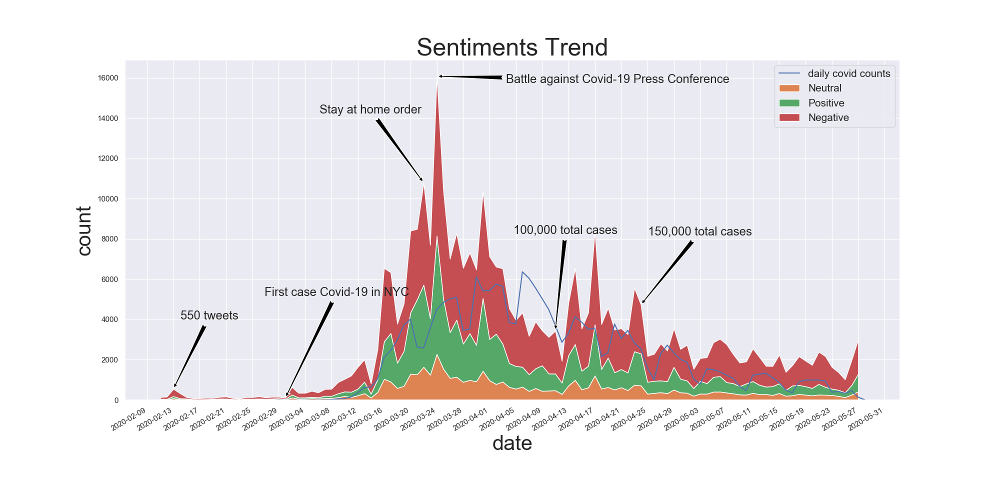
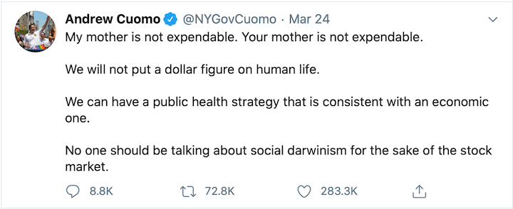
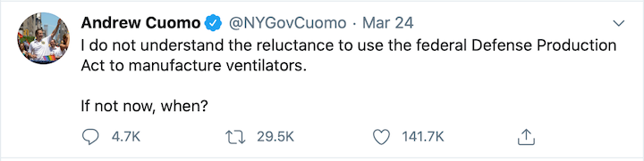
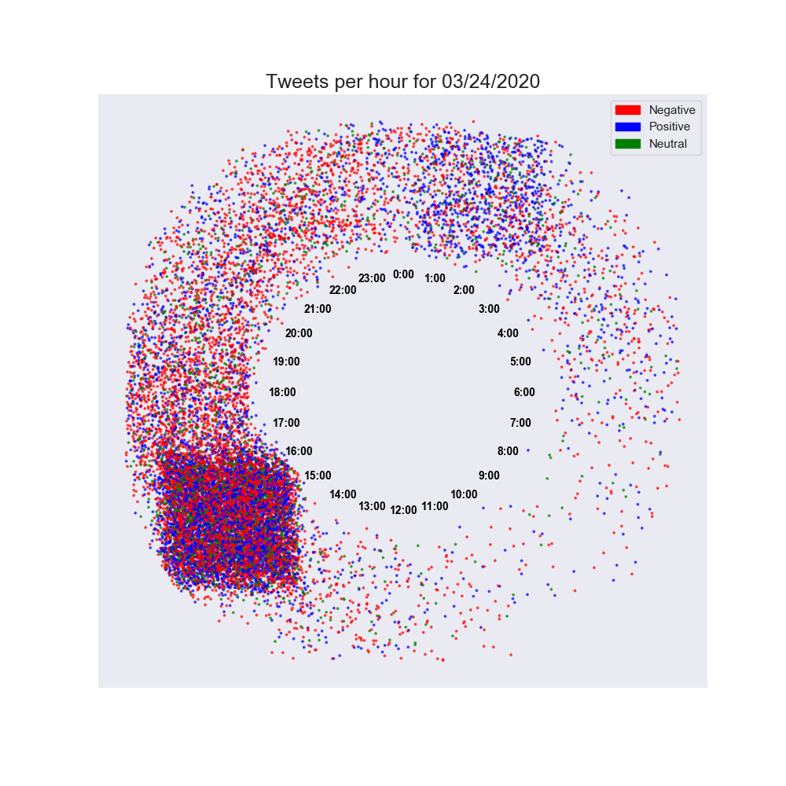

Analyzing sentiments of tweets mentioning Gov Andrew Cuomo through the COVID-19 pandemic.
================

Overview
--------

In this project, I analyzed tweets that mentioned 'cuomo' over the months of the pandemic to analyze the sentiments towards Governor Andrew Cuomo. I used pre-trained library flair to get sentiments of all the tweets and visualized it.

The first case of COVID-19 in the U.S. state of New York during the pandemic was confirmed on March 1, 2020. I have used the tweets from 02/15/2020 to 05/27/2020 to run sentiment analysis on it. 

Scope of this project:
--------

I have __excluded__ retweets, replies and links as I believe, as a retweet/reply is more of a response to a tweet/article rather than a general sentiment towards Gov Cuomo. In doing so, I have also filtered out news articles as they are associated with links. Also, I have excluded tweets that contain 'chris' in them to avoid getting sentiments for Chris Cuomo (brother of Gov. Andrew Cuomo)


Part 1: Data Collection
---------------------

The conventional tweeter API - [Tweepy](https://github.com/tweepy/tweepy) can be used to download the tweets. However, it is important to note limitations of the tweepy such as accessing historical tweets and rate limits. 

Other libraries such as [GetOldTweets3](https://github.com/Mottl/GetOldTweets3) and [twitterscraper](https://github.com/taspinar/twitterscraper) provide excellent alternatives, specially when downloading historical data. 

There are a few ways of downloading the tweets. They are all provided [here](https://github.com/udipbohara/Gov-cuomo/tree/master/scrapers). _Note_: Due to errors such as Request timeouts/handling errors, it is advisable to download batches of tweets (eg: one day at a time). 
A total of 327894 tweets were extracted. Here is an example of a json object: Full raw data can be found in /data

The secondary data (covid-19 counts for New York) was collected from the New York 

Part 2: Workings of flair
---------------------
[Flair](https://github.com/flairNLP/flair) is a state of the art library for NLP. Sentiment analysis done using the [distilBERT](https://arxiv.org/pdf/1910.01108.pdf): a framework built on top of BERT. 

```
$ pip install flair
```
Flair sentiment is based on character level pretrained LSTM neutral network which takes the context of the words into account while predicting the overall label. It is an open source library with many contributions for training the models which gives it the strength in being able to make good predictions. Due to that, the library is __very well equipped to handle typos as well__. This works perfectly well working with tweets as  they have typos in them.  


The tweets were trained individually by flair. Here is how it works under the hood:

<p align="center">
  </img>
  
</img>
</p>

``` python
from flair.models import TextClassifier
from flair.data import Sentence
example_tweet = "insert tweet here"
tagger = TextClassifier.load('sentiment')
tagger.predict(example_tweet)
```

__The left__ column of the heatmap shows the overall score for the sentence followed by individual scores for the words.


</img>


</img>


Part 3: Analysis
---------------------
With the rise in the covid cases, the rise in the tweets increased almost symmetrically as shown by the graph below.
Important to note that the date range  is __05/27/2020__
</img>

However, upon stack-plotting the count for tweets of sentiments, it is apparent that the negative tweets are much larger compared to the neutral and positive tweets.

 </img>

We can see a clear spike on March 24th. Upon looking further into that date, it was when Gov Cuomo made a compelling speech against Coronavirus asking the federal govermen for more ventilators. He also made moving addresses in his press conference for that day. 

His tweets vaildate the concern on that day:

 </img>
 </img>
 </img>

Upon plotting the tweets as a 'clock-plot' it became evident that most of the tweets were after 1:00PM / 13:00 UTC which was when he held daily press conferences. So, it was quite interesting to see the correlation in that. Even in days with lesser counts, the cluster during that timeframe remained the same. 

</img>
</img>
