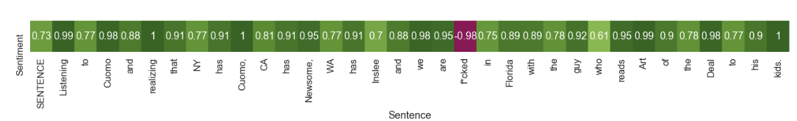

Analyzing sentiments of tweets mentioning Gov Andrew Cuomo through the COVID-19 pandemic using tweets.
================

Overview
--------

In this project, I analyzed tweets that mentioned 'cuomo' over the months of the pandemic to see the response towards him. I used pre-trained library flair to get sentiments of all the tweets and visualized it.

The first case of COVID-19 in the U.S. state of New York during the pandemic was confirmed on March 1, 2020. I have used the tweets from 02/15/2020 to 05/18/2020 to run sentiment analysis on it. 

Scope of this project:
--------

I have __excluded__ retweets, replies and links as I believe, as a retweet/reply is more of a response to a tweet/article rather than a general sentiment towards Gov Cuomo. In doing so, I have also filtered out news articles as they are associated with links. Also, I have excluded tweets that contain 'chris' in them to avoid getting sentiments for Chris Cuomo (brother of Gov. Andrew Cuomo)


Part 1: Download Data
---------------------

The conventional tweeter API - [Tweepy](https://github.com/tweepy/tweepy) can be used to download the tweets. However, it is important to note limitations of the tweepy such as accessing historical tweets and rate limits. 

Other libraries such as [GetOldTweets3](https://github.com/Mottl/GetOldTweets3) and [twitterscraper](https://github.com/taspinar/twitterscraper) provide excellent alternatives, specially when downloading historical data. 

There are a few ways of downloading the tweets. They are all provided [here](https://github.com/udipbohara/Gov-cuomo/tree/master/scrapers). _Note_: Due to errors such as Request timeouts/handling errors, it is advisable to download batches of tweets (eg: one day at a time). 
A total of 327894 tweets were extracted. Here is an example of a json object: Full raw data can be found in /data


Part 2: Workings of flair
---------------------
[Flair](https://github.com/flairNLP/flair) is a state of the art library for NLP. Sentiment analysis done using the [distilBERT](https://arxiv.org/pdf/1910.01108.pdf): a framework built on top of BERT. 

```
$ pip install flair
```
Flair sentiment is based on character level pretrained LSTM neutral network which takes individual words into account while predicting the overall label. Due to it being a strongly pretrained library along with the LSTM approach, the analysis is contextual. Due to that, the library is __very well equipped to handle typos as well__. This works perfectly well working with tweets as  they have typos in them.  

 Details of the parameters of the model are:

``` python
 Model config DistilBertConfig {
  "activation": "gelu",
  "architectures": [
    "DistilBertForMaskedLM"
  ],
  "attention_dropout": 0.1,
  "dim": 768,
  "dropout": 0.1,
  "hidden_dim": 3072,
  "initializer_range": 0.02,
  "max_position_embeddings": 512,
  "model_type": "distilbert",
  "n_heads": 12,
  "n_layers": 6,
  "pad_token_id": 0,
  "qa_dropout": 0.1,
  "seq_classif_dropout": 0.2,
  "sinusoidal_pos_embds": false,
  "tie_weights_": true,
  "vocab_size": 30522
}
```

The tweets were trained individually by flair. Here is how it works under the hood:


<p align="center">
  </img>
  
</img>
</p>

``` python
from flair.models import TextClassifier
from flair.data import Sentence
example_tweet = "insert tweet here"
tagger = TextClassifier.load('sentiment')
sentence = Sentence('Cuomo is doing the best he can!')
tagger.predict(sentence)
```
__The left__ column of the heatmap shows the overall score for the sentence followed by individual scores for the words.


</img>



</img>


Part 3: Analysis
---------------------

